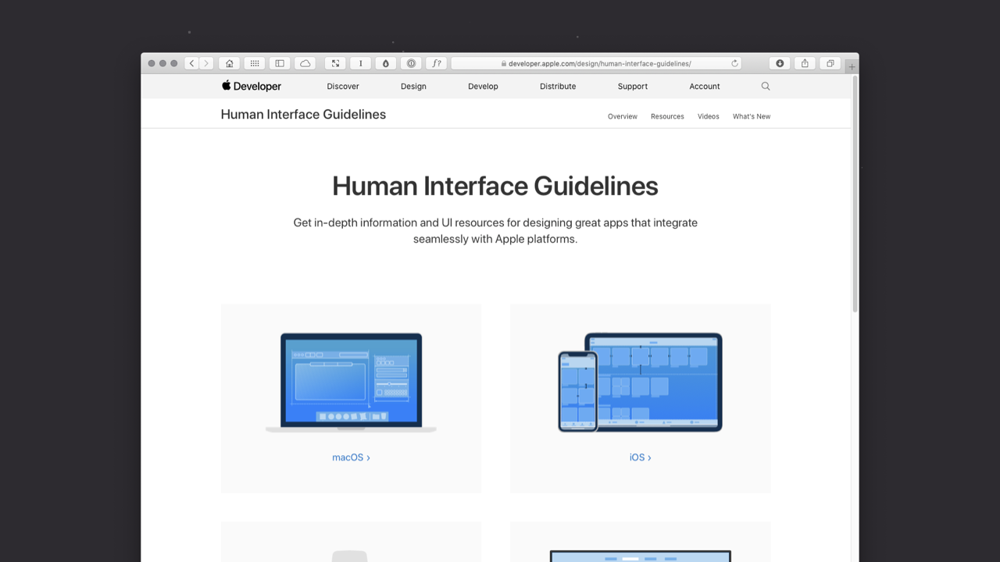
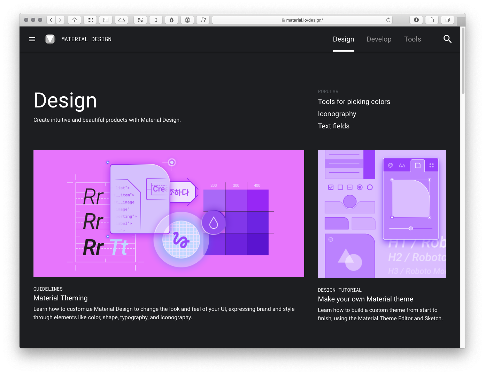
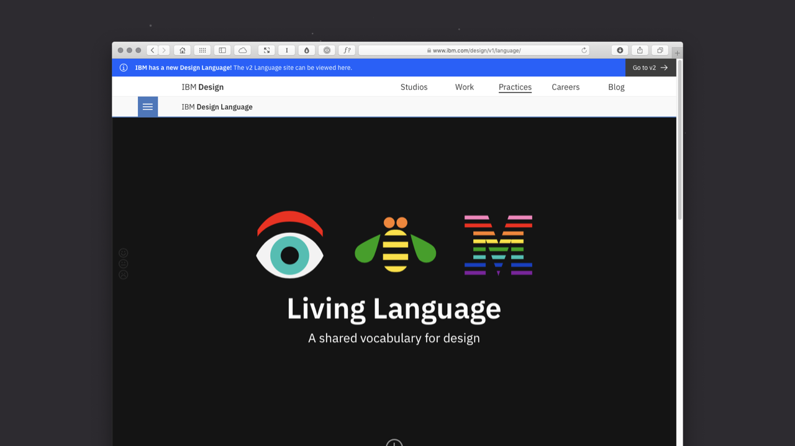
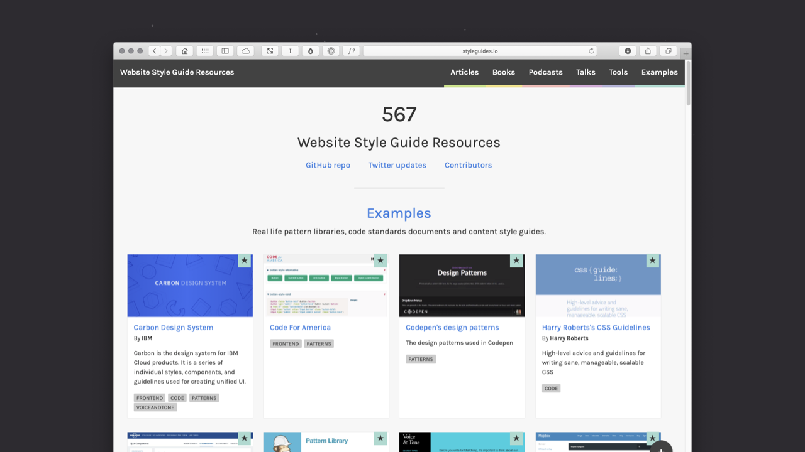

Chapter 1: Designing Interfaces
===============================

<!-- 3,283 Words -->

**As I’ve noted in the [overview](https://github.com/fehler/building-beautiful-uis/blob/master/00-Overview.md), this is a work in progress and I’m sharing it here in draft form. It isn’t finished, but I hope it provides some value as I finalise all of the chapter content.**

<!--

Note to self: Should each chapter spell out user interface in full before subsequently using UI? I think each chapter should kick off with user interface in full, that way folks who have skipped Chapter 1, or who have dived right into a later chapter, get the term spelled out in full before the acronym.

-->

Table of Contents
-----------------

+ [Section 1: The ‘UI’ in ‘GUI’](https://github.com/fehler/building-beautiful-uis/blob/master/01-Chapter-1-Designing-Interfaces.md#section-1-the-ui-in-gui)
+ [Section 2: Designing Human Interfaces](https://github.com/fehler/building-beautiful-uis/blob/master/01-Chapter-1-Designing-Interfaces.md#section-2-designing-human-interfaces)
+ [Section 3: Desktops and Metaphors](https://github.com/fehler/building-beautiful-uis/blob/master/01-Chapter-1-Designing-Interfaces.md#section-3-desktops-and-metaphors)
+ [Section 4: Establishing Clear Mental Models](https://github.com/fehler/building-beautiful-uis/blob/master/01-Chapter-1-Designing-Interfaces.md#section-4-establishing-clear-mental-models)
+ [Section 5: UI, Here and Now](https://github.com/fehler/building-beautiful-uis/blob/master/01-Chapter-1-Designing-Interfaces.md#section-5-ui-here-and-now)

Summary
-------

**In this chapter I’ll explore how we arrived at where we are today. I’ll provide a brief history of user interface design – drawing from principles of human-computer interaction (HCI) – before detailing a number of current user interface design systems, including: Apple’s Human Interface Guidelines; Google’s Material Design and IBM’s Living Language.**

<!-- Above is missing mental models, desktops and metaphors, etc.. Add this in, but keep it tight. -->

Overview
--------

<!--

The following should perhaps be moved to the book overview.

InVision’s author – Jane Portman – kicks off with an explanation of the app she’s building and how that’s informed her book. I think we should do the same, but draw on:

1. My last semester of teaching (maybe link to example student projects?); and
2. My consulting work, in particular with Little Thunder.

-->

I’m a firm believer in drawing my teaching materials from the real world. As an Associate Senior Lecturer at Belfast School of Art (teaching half-time) I’m fortunate to divide my time between:

+ real world design projects for a wide range of clients, large and small; and

+ teaching students on my undergraduate Interaction Design programme.

Everything in this book (and its accompanying materials) has been tried and tested. I’ve drawn the examples from research I’ve undertaken, client projects I’ve worked on and – where appropriate – samples of my students’ work.

I’ve included my students’ work, because I’m proud of the work they’re doing and – equally importantly - these are relatively young students and they’ve come a long way with their User Interface (UI) design in a relatively short space of time. I hope their work inspires you to do similarly impressive work.

In this first chapter I’ll set the scene, providing a little history and context. If you’re up-to-speed on the history of user interface design, and have an understanding of the importance of metaphors and mental models, you might wish to fast-forward to [Chapter 2](#) where I get into hands-on practicalities.

UI design stretches back to the early GUIs of the 70s and the emergence of computers as devices that were available beyond the confines of universities and big businesses.

The rise of the personal computer – a revolutionary idea in its time – brought with it the need for a way to interact with computers that was as easy and friendly as possible.

This intense period in computing history saw the emergence of the field of Human-Computer Interaction (HCI), focused on the relationship between the design of computer technology and the interaction between humans (users) and computers.

Section 1: The ‘UI’ in ‘GUI’
----------------------------

**CAPTION: Caption here.**

Before I dive into the depths of user interfaces (UIs), I think it’s important to get some definitions out of the way. The term ‘UI’ we know and love today has its origins in the 70s term ‘GUI’, an abbreviation of **graphical user interface**.

UIs might feel commonplace to us today, but when they were first imagined they represented a fundamental shift in how we interacted with computers. Before the emergence of GUIs, working with a computer involved typing arcane commands into it via a text-based terminal.

To work with a computer a user first needed to ‘learn its language’, no small task. The emergence of graphical user interfaces allowed for a much friendlier (and easier to learn) way of interacting with computers. /* Reword the following from Wikipedia, so it’s in my words, because it bridges to Apple. */

> In 1973, Xerox PARC developed the Alto personal computer. It had a bitmapped screen, and was the first computer to demonstrate the desktop metaphor and graphical user interface (GUI).

The Alto’s interface informed the development of the first GUI at Xerox PARC, which used windows, icons and menus and allows the user to open, move and delete files.

One of the best known early GUIs was Apple’s pre-OS X operating system. System 7 (which was the first graphical user interface I started using many, many years ago!) was considerably easier to navigate than issuing commands via a keyboard.

This graphical interface coupled with the use of a mouse changed computing forever. Users could directly interact with the objects within an interface manipulating them directly.

The emergence of the very first iPhone in 20XX took this a small, but important step further. Instead of using a mouse, on your iPhone you were using your fingers to **directly manipulate the interface**.

This shift away from the abstraction, one-step-removed, of a mouse towards physically interacting with objects on a screen underlies our current context. In a desktop context we still use mice, but in an increasingly mobile context we find ourselves interacting directly with the UI, **physically touching objects on a screen**.

Understanding this history might seem like a distraction, but spending a little time familiarising yourself with it helps you understand timeless principles, **still relevant today**, like:

+ Information Architecture
+ Human-Computer Interaction
+ The Use of Metaphor in UI
+ Mental Models
+ …

**IMG: 1/3 Terminal; 1/3 System 7; 1/3 iOS**

**CAPTION: Half a century of user interface design in an image. On the left, the terminal; in the middle System 7; on the right iOS.**

Of course user interfaces have come a long, long way since the early 70s (TK) and we’re now witnessing the rise of non-graphical user interfaces, particularly conversational and voice interfaces. In this book, I’ll focus primarily on graphical user interfaces across a range of contexts:

+ Desktop (Mouse)
+ Tablet → Smartphone (Finger)
+ Wrist (Finger)

If conversational and voice interfaces interest you, have no fear, I have you covered. I’ll explore where interfaces are heading in Chapter 9. So I’ll be covering all of the bases.

Section 2: Designing Human Interfaces
-------------------------------------

**CAPTION: Caption here.**

The trouble with the term ‘user interface’ is that it abstracts humans (messy, unpredictable and… human!) into an anonymous category of ‘users’. In fact these users are all different, above all, they’re all **humans**.

I’m not going to reinvent the wheel and call this book *Building Beautiful HIs*, but as you read it – and as you design – put some thought into the different humans that will use the designs you create. Consider:

+ Age: Young and Old
+ Gender: Male and Female (And everything in between or outside these terms.)
+ Geographical Context: Where in the world these users are.
+ …

It’s critical to consider the above mix so that he UIs we design cater to as wide an audience as possible. Designing for accessibility and inclusivity is important in our increasingly diverse global culture. Let’s factor this in.

It’s no surprise to me that Apple chose to name its excellent Human Interface Guidelines (HIG) **Human** Interface Guidelines, not **User** Interface Guidelines. By embracing the term ‘human’, Apple acknowledges that at the receiving end of every interface lies a human, and that human wants to get something done.

When you’re designing a UI, bear in mind that the user at the receiving end of the interface will very likely be dealing with everyday distractions. As such, it’s important to ensure your UI is easy to understand and distraction free.

Humans are trying to achieve tasks – perhaps to book a flight, or to buy a book – while juggling other human tasks, for example, feeding a baby. Understanding this is critical. The best user interfaces get out of the way and help you to get things done with the minimum of fuss.

By focusing on first principles you’ll improve your UI by:

+ getting out of the user’s way;
+ focusing on maximum functionality; and
+ helping your users (preferably minimising opportunities for error).

Few, if any, users will come to your interface without prior knowledge (of other interfaces), as such, it’s important to understand ‘received knowledge’ that your users bring to your interface. We all use interfaces day in, day out and – as we use them – we learn conventions, standardised approaches towards particular problems. Before we get into the fundamental of designing UIs, it’s worth mentioning two important concepts:

+ Metaphors; and
+ Mental Models

I’ll explore these in the next two sections. Unless you’re deeply aware of these principles, **I’d strongly recommend you resist the urge to fast-forward to Chapter 2**. Every interface you design will benefit from an understanding of metaphors and mental models so let’s dive in and explore them.

Section 3: Desktops and Metaphors
---------------------------------

**CAPTION: Caption here.**

If you’ve ever bought anything from Amazon, you’ll have encountered metaphors. When you add something to your basket at Amazon, there is in fact no ‘basket’. The basket is just a metaphor – drawn from the real world – to help you understand where you store your items.

As you check out and pay for your items, there is (thankfully) no check out line. You simply pay with your credit card and, magically, your purchases are on their way. This is metaphor in action.

By using everyday models from the ’real’ world, we can design easily understandable UIs that need very little in the way of explanation.

**IMG: Baskets (Amazon, iTunes, etc.)**

**CAPTION: By embracing the basket metaphor, all of these different UIs adhere to a common language. Users understand – thanks to regular use – what a basket stands for. This metaphor eases their use of the UI (a win!).**

Understanding the existing use of metaphors is important. If a convention exists – a shopping basket, for example – it’s best to stick with this metaphor and resist the urge to invent a new one.

When users navigate a UI that is new to them, they do so with the received knowledge of **every other UI they have ever used**. Even if your UI is for a new product that’s breaking new ground, there will be conventions you can draw upon.

Returning to our checkout metaphor, if your product features payments of any kind, your UI will benefit from following pre-existing checkout conventions. Users might:

+ add items to their ‘basket‘;
+ continue browsing the ’store’, before returning to their basket; and
+ finally, ‘checking out‘.

When Apple launched its System 7 (and earlier) GUIs it used metaphors extensively. By using a ‘desktop metaphor’, users could understand and build a mental model of how everything worked.

When a user stored a ‘document’ in a ‘folder’, they understood that there was no physical, paper document per se, or even a folder. They understood that these were simply metaphors to help explain what was happening under the hood in an easy to understand manner.

Similarly, when users discarded an item in the ‘trash’ and later ‘emptied the trash’, no trash lorry arrived at their house.

This foundational use of metaphor stretches so far back that it has informed almost every operating since and has mapped over from a desktop context to a mobile context.

By using an ‘iconic’ approach, we can summarise concepts in an easy to follow manner. For example, we might use:

+ A ‘cog’ icon that users understand represents ‘settings’.
+ An ‘envelope’ icon that represents ‘email’.
+ Or a ‘folder’ icon that represents a place to organise files.

Designers have co-opted ‘real world’ objects to represent digital objects. When we click on a cog, we know that the settings we’re about to modify aren’t made up of actual cogs, this is just an idea.

Section 4: Establishing Clear Mental Models
-------------------------------------------

**CAPTION: Caption here.**

Whatever the interfaces we design, it’s highly likely that **our users will have experienced other interfaces that will have established a ‘mental model’ in their mind of how things work**. As Jakob Nielsen puts it:

> What users believe they know about a user interface strongly impacts how they use it. […] Mental models are one of the most important concepts in human-computer interaction.

Users have mental models based upon their past experiences and it’s important that we take these mental models on board when considering our user interface design. **A mental model is what the user believes about the system they are using.** Put simply:

+ Mental models are based upon beliefs, not facts: that is they are mental models of what users know – or think they know – about the interface that you’re designing.

+ Individual users have different mental models based upon their own unique past experiences.

One of the biggest problems we run into when designing user interfaces is **the conflict between what we – as the designers of the interface – know about the underlying system and how it works, and how users expect things to work**.

When considering your information architecture, it helps to consider how your interface relates to others’ interfaces. In short: **Users expect sites and applications to act and work alike.** Introducing new models can lead to confusion on the part of the user, resulting in an interface that doesn’t work.

Regardless of what we’re designing, we can embrace fundamental principles of design to ensure that our interfaces benefit from a clear visual hierarchy, ensuring complex information is easy to understand and navigate through, as I’ll explore this in [Chapter 3](#).

<!--

This section feels a little short in comparison to the others. Look at NN/g:

https://www.nngroup.com/articles/mental-models/

-->

Section 5: UI, Here and Now
---------------------------

**CAPTION: Caption here.**

Fortunately there are a wealth of resources available to us that can inform our understanding of UI design. Apple’s Human Interface Guidelines, Google’s Material Design, and IBM’s Living Language all offer lessons we can learn from.

These provide a useful overview of designing interfaces at a high level and are well worth exploring before we get into analysing how interfaces are built in Chapter 2.

As I noted earlier, I think the fact that Apple provides human interface guidelines – and not user interface guidelines – is an important distinction. We’re seeing a return to terms like human-centred design (as opposed to, say, user experience design) and Apple’s [Human Interface Guidelines](https://developer.apple.com/design/human-interface-guidelines/) naming is prescient.

Apple is treading a bit of a tightrope, clearly they don’t want to lose sight of their heritage (and their first set of groundbreaking Human Interface Guidelines), but – as you’ll see in the copy on their page – they use both terms: **human** interface and **user** interface.

Caption: Apple’s Human Interface Guidelines provide in-depth information and resources for designing interfaces that work on Apple’s various operating systems (macOS, iOs and watchOS).

Developed in 2014, Google’s [Material Design](https://material.io/design/) expanded on the ‘card’ motifs that debuted in Google Now. Material Design uses more grid-based layouts, responsive animations and transitions, padding, and depth effects such as lighting and shadows.

<!-- Check the above paragraph, it feels like it’s from Google’s Material Design copy. -->

Caption: Google’s Material Design guidelines provide in-depth information and resources for designing interfaces that work.

IBM’s [Living Language](https://www.ibm.com/design/language/) – designed to be a shared vocabulary for design – represents IBM’s move into a design-driven culture and is well worth exploring. Currently on v2, IBM are also maintaining an archive of past versions, which offer a great deal of practical advice for designing user interfaces.

As IBM put it in their Living Language: “Focus on users’ goals. Design tools that lead people to actionable insights. Be proactive, always anticipating users’ next moves and helping them prepare for change.”

Caption: IBM’s Living Language is described as, “A shared vocabulary for design.” It represents IBM’s move into a design-driven culture and is well worth exploring.

Lastly, [styleguides.io](#) is a very useful roundup of other approaches to developing user interface libraries and style guides. It’s worth bookmarking and offers an insight into how a wide range of companies are moving towards the development of visually consistent user interface libraries.

Caption: styleguides.io is also worth bookmarking for a useful overview of how other companies – at a wide range of scales – are handling user interface design.

Further Reading
---------------

There are many great publications, offline and online, that will help further underpin your understanding of user interface design. I’ve included a few below to start you on your journey.

+ I’d strongly suggest starting by exploring Apple’s [Human Interface Guidelines](https://developer.apple.com/design/human-interface-guidelines/), Google’s [Material Design](https://material.io/design/) resources, and IBM’s Living Language ([Version 1](https://www.ibm.com/design/v1/language/) and [Version 2](https://www.ibm.com/design/language/)). These provide a useful overview of designing interfaces at a high level and offer an insight into the design vocabularies of different platforms.

+ The Interaction Design Foundation have a useful overview of UI design titled [What is User Interface (UI) Design?](https://www.interaction-design.org/literature/topics/ui-design) It’s well worth a read for a high level introduction to user interface design.

+ Lastly, Nielsen Norman Group have a comprehensive overview on [Mental Models](https://www.nngroup.com/articles/mental-models/) that is well worth reading. Additionally, they have [a wealth of additional articles and videos](https://www.nngroup.com/search/?q=mental+models) on the topic, that are worth exploring.

About the Author
----------------

### Christopher Murphy

[@fehler](https://www.twitter.com/fehler)

A designer, writer and speaker based in Belfast, Christopher mentors purpose-driven businesses, helping them to launch and thrive. He encourages small businesses to think big and he enables big businesses to think small.

The author of numerous books, he is currently hard at work on his eighth, ‘Designing Delightful Experiences’, for Smashing Magazine and ninth, ‘Building Beautiful UIs’, for Adobe. Both are accompanied by a wealth of digital resources, and are drawn from Christopher’s 15+ years of experience as a design educator.

As a design strategist he has worked with companies, large and small, to help drive innovation, drawing on his 25+ years of experience working with clients including: Adobe, EA and the BBC.

---

I hope you find this resource useful. I’m also currently working on a book for the fine folks at [Smashing Magazine](https://www.smashingmagazine.com) – ‘Designing Delightful Experiences’ – which focuses on the user experience design process from start to finish. It will be published in late 2019.

You might like to [follow me](https://www.twitter.com/fehler) on Twitter for updates on this book, that book and other projects I’m working on.

**Copyright · Adobe XD + Mr Murphy Ltd.**