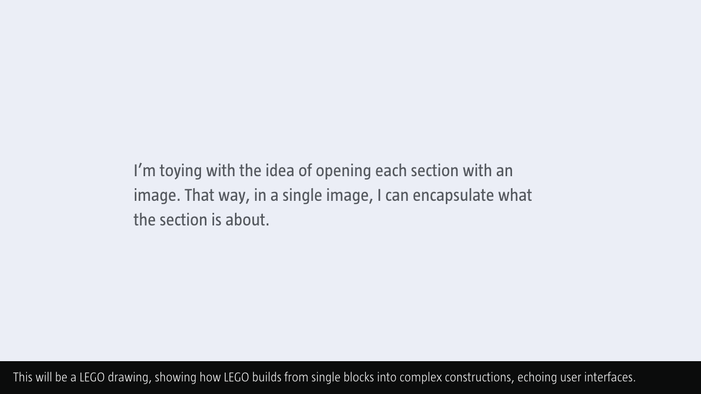
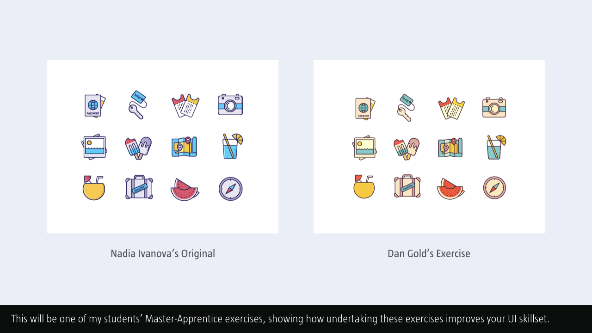
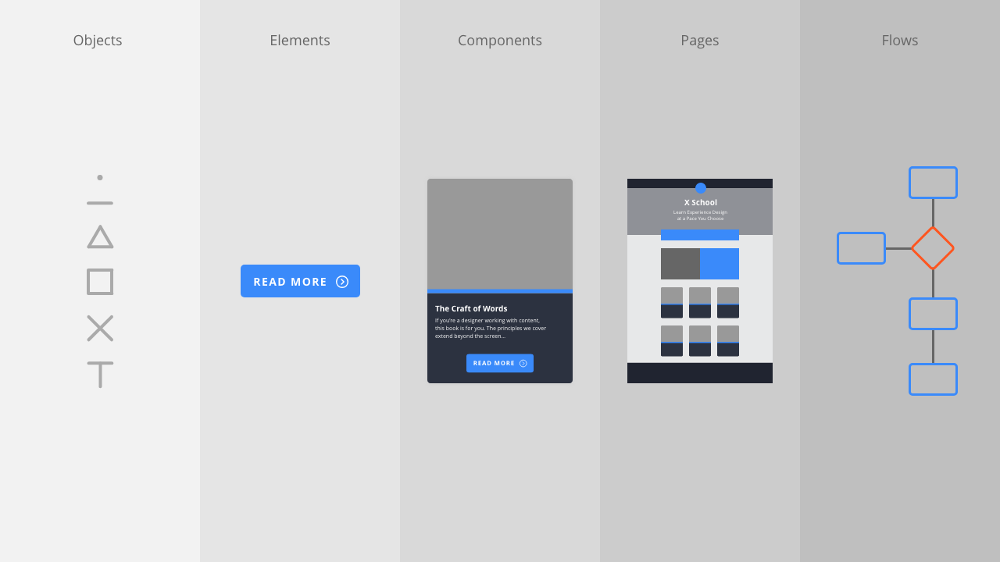

Chapter 2: The Building Blocks of Interfaces
============================================

<!-- 2,564 Words -->

**As I’ve noted in the [overview](https://github.com/fehler/building-beautiful-uis/blob/master/00-Overview.md), this is a work in progress and I’m sharing it here in draft form. It isn’t finished, but I hope it provides some value as I finalise all of the chapter content.**

<!--

Note to self: Should each chapter spell out user interface in full before subsequently using UI? I think each chapter should kick off with user interface in full, that way folks who have skipped Chapter 1, or who have dived right into a later chapter, get the term spelled out in full before the acronym.

I’ve used a naming convention in Chapters 2–4 (and later) that’s as follows:

Objects → Elements → Components → Pages → Flows

The ‘Components’ in the new XD are what I call ‘Elements’. Gah! I’m going to go back over everything and change to:

Objects → Components → Modules → Pages → Flows

Modules, or Units? (I prefer Modules.)

-->

Table of Contents
-----------------

+ [Section 1: Interfaces Are Like LEGO](https://github.com/fehler/building-beautiful-uis/blob/master/02-Chapter-2-The-Building-Blocks-of-Interfaces.md#section-1-interfaces-are-like-lego)
+ [Section 2: Objects → Elements → Components → Pages → Flows](https://github.com/fehler/building-beautiful-uis/blob/master/02-Chapter-2-The-Building-Blocks-of-Interfaces.md#section-2-objects--elements--components--pages--flows)
+ [Section 3: A Library of Elements](https://github.com/fehler/building-beautiful-uis/blob/master/02-Chapter-2-The-Building-Blocks-of-Interfaces.md#section-3-a-library-of-elements)
+ [Section 4: The Wonderful World of Icons](https://github.com/fehler/building-beautiful-uis/blob/master/02-Chapter-2-The-Building-Blocks-of-Interfaces.md#section-4-the-wonderful-world-of-icons)
+ [Section 5: Design Systems](https://github.com/fehler/building-beautiful-uis/blob/master/02-Chapter-2-The-Building-Blocks-of-Interfaces.md#section-5-design-systems)

Summary
-------

In this chapter **I’ll introduce the fundamental building blocks that interfaces are made from**: Objects, Elements, Components, Pages and Flows. **I’ll break apart a series of interface elements** – which I’ll also provide as swipe files for reference – **and I’ll analyse how everything we use in an interface is constructed from simple building blocks**.

I’ve created a series of supporting files – PDF scratch files and Adobe XD artboards – to accompany this chapter (and many of the other chapters). **These supporting files walk through the process for more visual learners and can be used alongside the book.**

Overview
--------

Over the following three, connected chapters **I’ll progressively introduce the fundamentals of user interface design** step by step. These three chapters are essentially the heart of the book – I’d strongly encourage you to read all of them – **they will introduce you to the principles you need to master to become a fully-fledged user interface designer**.

In this chapter, ‘The Building Blocks of Interfaces’, I’ll introduce the idea of **a core set of elements with which we can build interfaces**. These include: buttons, toggles, tags and other essential elements. I’ll show how these elements are constructed and explain **how they form the basis of a consistent, yet flexible, design system**.

In Chapter 3, ‘Information Architecture’, **I’ll explore how we can combine these elements to create components, out of which we build pages**. These components include familiar design patterns, including ‘cards’, **popularised by Google’s [Material Design](#) principles**. Lastly – as the chapter’s title promises – **I’ll explore the principles of information architecture**.

In Chapter 4, ‘Getting From A → B’, **I’ll tie everything together by introducing the idea of ‘journey mapping’ and ‘user flows’**. By focusing on how pages are connected together I’ll explore the last piece of the user interface jigsaw: **considering how users move through an interface**, getting from A → B.

With the Chapter 2-4 context mapped out, let’s get down to business and explore the fundamental building blocks of user interfaces: elements.

Section 1: Interfaces Are Like LEGO
-----------------------------------

**CAPTION: With a mountain of LEGO bricks, we can build virtually anything. We’re limited only by our imagination. User interfaces are the same: Once we’ve created some basic elements – buttons, toggles and tags, for example – we can build any UI we desire.**

When you’re starting on your journey as a user interface (UI) designer **it can be intimidating trying to work out how different interfaces are built**.

Take any interface, however, and you’ll see that **even the most complicated of interfaces is built up of simpler elements and components**. By starting with these elements and components you can quickly develop an understanding of how UIs are constructed.

Working with my students at Belfast School of Art, I encourage them to **take existing interfaces and break them down into their constituent parts**. By using a [‘Master-Apprentice‘](https://github.com/fehler/building-beautiful-uis/blob/master/10-Appendix-1-Master-Apprentice-Exercises.md) approach – analysing others’ interfaces and rebuilding them – **you not only learn about how interfaces are constructed, but you also begin to understand the principles that lie behind good interfaces**.

### The Master-Apprentice Model

The Master-Apprentice model stretches back to the days of painters like [Rembrandt](https://oldmasters.academy/old-masters-academy-art-lessons/who-were-rembrandts-teachers-and-students) and I believe it’s worth revisiting. **By focusing on rebuilding others’ interfaces to start with, you learn to ‘train your eye’.** This approach also helps you to develop the techniques you need to master before putting them into practice in your own creative work.

In the 17th century, apprentices’s education was undertaken for a minimum of 2-3 years, and – at times – for as many as seven years. A two year apprenticeship was considered to be the minimum, with guild rules dictating that an apprentice couldn’t leave their master before their term had ended. An apprenticeship was an investment, with a total cost of 600-700 guilders, which could buy a small house at that time.

The good news is that – in our connected world underpinned by the web – **you can embark upon a ‘virtual apprenticeship’ at relatively little cost**. All you need is time and a willingness to work hard and learn. [Dribbble](https://dribbble.com/search?q=UI) is a good place to start. **Search for UI, choose something you like and rebuild it.**

**CAPTION: Dan Gold, a second year student on my Interaction Design programme at Belfast School of Art, created the above Master-Apprentice exercise. On the left is the original, by Nadia Ivanova, on the right is Dan’s exercise.**

To help you on your learning journey **I’ve provided a series of ‘Master-Apprentice’ examples** in addition to the example above, so you can see how these exercises work.

I’ve provided examples of desktop, mobile (smartphone, tablet) and wrist UIs so **you can begin to develop an understanding across a range of contexts**. I created these myself so that I could develop my skills. I might be fast approaching 50 years old, but I’m still learning!

<!--

Somewhere, stress that this isn’t just something beginners do. Professionals do this, too, including lots of well known folks. Here’s something by Chris Coyier:

https://culturedcode.com/status/

https://codepen.io/chriscoyier/full/KLWgVy

In the interview with Howard P, touch on this in one of the questions.

-->

### LEGO FTW!

One of the reasons that LEGO is such a much-loved product is the fact that **from a series of individual building blocks you can make almost anything you put your mind to**. You’re limited only by your imagination.

Just like LEGO blocks can be combined to create relatively complicated constructions, so, too, **complex interfaces are created from relatively simple elements**.

Break apart any page – whether it’s desktop-, mobile- or wrist-based – and you’ll see that it’s created from a series of elements and components. **Mastering how to draw these different elements and components will put you in a position to create anything your UI requires.**

**CAPTION: Break apart any page and you’ll see it’s create from elements and components. Mastering how to draw these building blocks is what will establish a firm foundation on which to build.**

The temptation when you’re starting out is to dive in at the deep end and try to build something all-encompassing and complicated. This isn’t an approach I’d recommend. **Taking on too big a challenge can quickly lead to frustration because you’ve undertaken a task that’s far too complicated.**

A far better approach – one that LEGO also uses – is to **start with something simple and progressively add complexity**. Practice makes perfect and as Mr Miyagi – from the film [The Karate Kid](https://www.youtube.com/watch?v=fULNUr0rvEc) – says: “Wax on! Wax off!” If you haven’t seen The Karate Kid: firstly, you should (the original, not the terrible remake); secondly, Mr Miyagi’s sage advice is simple: practice, practice, practice.

In short: **Master the fundamentals and the rest falls into place.**

With that out of the way, let’s take a look at the different constituent parts that comprise an interface and begin to unravel them.

Section 2: Objects → Elements → Components → Pages → Flows
----------------------------------------------------------

**CAPTION: Everything we build is created from relatively simple objects. By combining these objects in different ways we can create different user interface elements, which can then be combined to create components that are then organised on pages. Link these pages together and we have the flows that underpin everything we build.**

Everything we create is built from smaller parts. At the simplest level, user interfaces are comprised of the following:

+ Objects
+ Elements
+ Components
+ Pages
+ Flows

In this chapter, **I’ll be focusing on elements, demonstrating how they can be built from simple objects**.

In the next chapter, I’ll show how these **elements can be combined to create components and pages**, which form the backbone of user interfaces. In the following chapter, I’ll explore how we tie these separate pages together in flows.

This approach – Objects → Elements → Components → Pages → Flows – is similar to Brad Frost’s [Atomic Design](http://atomicdesign.bradfrost.com/chapter-2/) methodology. I never studied chemistry, so I find Frost’s naming convention – which features ‘atoms’ and ‘molecules’ from the world of chemistry, and ‘organisms’ from the world of biology – a little confusing.

<!-- Image: Brad Frost’s Atomic Design? Or is this too confusing given my methodology. -->

Frost’s methodology is also directed primarily at front-end designers who are using HTML, CSS and JavaScript. Designing interfaces in a tool like Adobe XD is increasingly separated from the world of code. (Although – to be clear, in case I spark the ‘designers should know how to code’ debate – it helps to at least have an understanding of code!)  Given the specialism we’re seeing emerging, I believe there’s a need for a different naming convention.

Looking at the illustration at the beginning of this section, I prefer the labels: objects, elements, components, pages and flows. I find these labels easier to grasp and they should, I feel, need no explanation.

### Objects → Elements 

This section is the heart of everything, it’s about how elements – the fundamental units from which we build interfaces – are created.

The emphasis on this chapter is that everything we encounter in a user interface – an element, a component or a page – is comprised of other, simpler elements.

Understanding how the basic building blocks of interfaces work – as a simple, element level – helps us to develop a language of elements that we can build into complex interfaces.

<!-- This section feels short, but I’m struggling to think about what else I can add to it. Revisit this with a clear head. -->

Section 3: A Library of Elements
--------------------------------

**CAPTION: Caption here.**

**This section – and the whole book – needs to have references to ‘components’ removed. In the May, 2019 update Adobe changed its terminology and stopped using ‘symbols’ in favour of calling these ‘components’. GAH!**

**It will lead to confusion if I refer to ‘components’ here, so I think I’m going to rename these groupings of elements to ‘modules’. (Although modules are also used when referencing APIs, so that might need a rethink, too.) In short this is a nightmare and I’m glad we picked it up now before the book was finished.**

This section is the heart of everything, it’s about how elements – the fundamental units from which we build interfaces – are created.

The emphasis on this chapter is that everything we encounter in a user interface – an element, a component or a page – is comprised of other, simpler elements.

Understanding how the basic building blocks of interfaces work – as a simple, element level – helps us to develop a language of elements that we can build into complex interfaces.

### A List of Common Elements

This isn’t an exhaustive list, but it does provide an overview of some typical elements you’ll need to consider.

There are many, many more elements in user interface design. Ever-helpful, usability.gov have put together lots of useful information at [User Interface Elements](https://www.usability.gov/how-to-and-tools/methods/user-interface-elements.html). As they put it:

> When designing your interface, try to be consistent and predictable in your choice of interface elements.
> 
> Whether they are aware of it or not, users have become familiar with elements acting in a certain way, so choosing to adopt those elements when appropriate will help with task completion, efficiency, and satisfaction.

The interfaces you design won’t necessarily need **all** of the elements that usability.gov list, but it will include a substantial number. As ever, if a pattern for something exists, use it. As I explored in Chapter 1, users have [mental models](https://github.com/fehler/building-beautiful-uis/blob/master/01-Chapter-1-Designing-Interfaces.md#section-4-establishing-clear-mental-models) of how things work. Sticking to these mental models as closely as you can will result in a user interface that’s clearer and more easily understood.

#### Buttons

Buttons indicate an action on click or touch and are typically labelled with text, an icon or both.

#### Toggles

Toggles allow users to change settings between two states, for example: on and off. Ensuring the on and off states are visually distinct improves toggles usability.

#### Tags

Useful in lots of contexts, for example in profile components or on content-driven pages.

#### Progress Bars

Progress bars communicate what stage a user is as at as they progress through a series of tasks. They can also be used to indicate other types of information, for example the progress of a download.

#### Tool Tips

Providing user feedback is essential and tool tips are a helpful way to do this, providing users with guidance where it’s needed.

Section 4: The Wonderful World of Icons
---------------------------------------

**CAPTION: Caption here.**

This section is all about iconography…

Icons aren’t really the same as elements, rather you might use them within elements or in addition to elements to create a user interface that communicates clearly.

MORE HERE ON ICONS

Section 5: Design Systems
-------------------------

**CAPTION: Caption here.**

This is now design systems…

As you design and build your user interface elements, it’s important to ensure they follow a consistent visual language. Do this at the element level and you will – by extension as you build modules from elements – have the basis of a design system.

Design systems are beyond the scope of this book, but they are well worth reading up on. I’d strongly recommend Alla Kholmatova’s [Design Systems: A Practical Guide to Creating Design Languages for Digital Products](https://shop.smashingmagazine.com/products/design-systems-by-alla-kholmatova?utm_source=shop&utm_medium=sidebar-widget) as a starting point.

Kholmatova shephered the development of FutureLearn’s [Design System](https://design-system.futurelearn.com), which is also worth looking at. Her knowledge of design systems is unparalleled and her book is excellent and well worth owning.

EXPLAIN - IN AN OVERVIEW WAY – WHAT A DESIGN SYSTEM IS.

Further Reading
---------------

There are many great publications, offline and online, that will help further underpin your understanding of the building blocks of interfaces. I’ve included a few below to start you on your journey.

+ Christian Leborg’s [Visual Grammar](https://amzn.to/31EaRoa) helps to explain the fundamental principles of visual grammar, the core graphic building blocks from which we build elements. It’s an excellent book that focuses on the foundations – point, line and plane – from which all interfaces are built.

+ Matej Latin’s [Better Web Typography](https://betterwebtype.com) is a fantastic ‘course in a book’ that offers a wealth of typographic advice for web designers and web developers. Latin’s book is equally applicable beyond the web (in mobile and other contexts) and he offers [a free, seven-part email course](https://betterwebtype.com/web-typography-course/) that’s well worth signing up for.

+ Lastly, I’d strongly recommend [Universal Principles of Design](https://amzn.to/2Fdftbn). It covers ‘125 Ways to Enhance Usability, Influence Perception, Increase Appeal, Make Better Design Decisions, and Teach through Design’ and I’ve used it as a backbone for my teaching since it was published.

About the Author
----------------

### Christopher Murphy

[@fehler](https://www.twitter.com/fehler)

A designer, writer and speaker based in Belfast, Christopher mentors purpose-driven businesses, helping them to launch and thrive. He encourages small businesses to think big and he enables big businesses to think small.

The author of numerous books, he is currently hard at work on his eighth, ‘Designing Delightful Experiences’, for Smashing Magazine and ninth, ‘Building Beautiful UIs’, for Adobe. Both are accompanied by a wealth of digital resources, and are drawn from Christopher’s 15+ years of experience as a design educator.

As a design strategist he has worked with companies, large and small, to help drive innovation, drawing on his 25+ years of experience working with clients including: Adobe, EA and the BBC.

---

I hope you find this resource useful. I’m also currently working on a book for the fine folks at [Smashing Magazine](https://www.smashingmagazine.com) – ‘Designing Delightful Experiences’ – which focuses on the user experience design process from start to finish. It will be published in late 2019.

You might like to [follow me](https://www.twitter.com/fehler) on Twitter for updates on this book, that book and other projects I’m working on.

**Copyright · Adobe XD + Mr Murphy Ltd.**