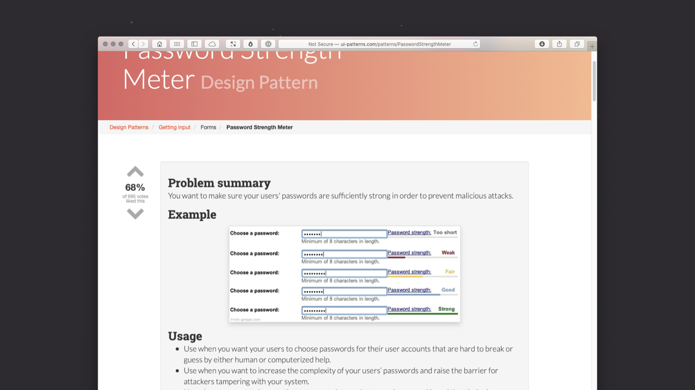
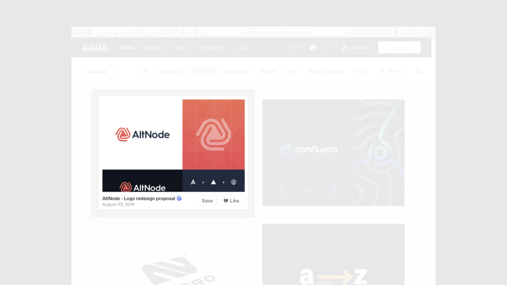
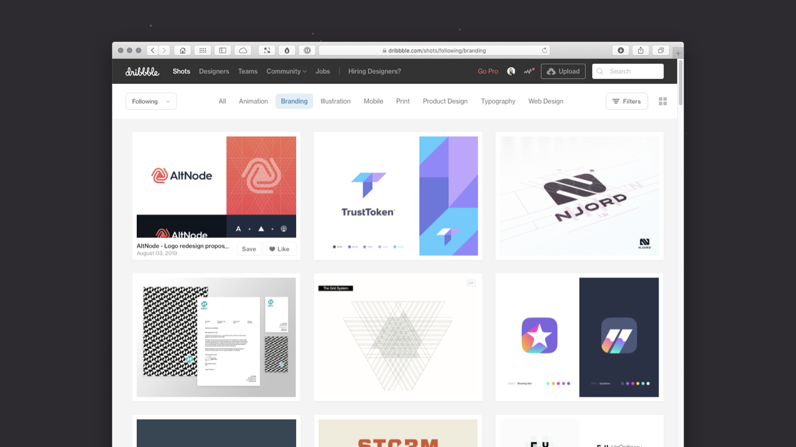
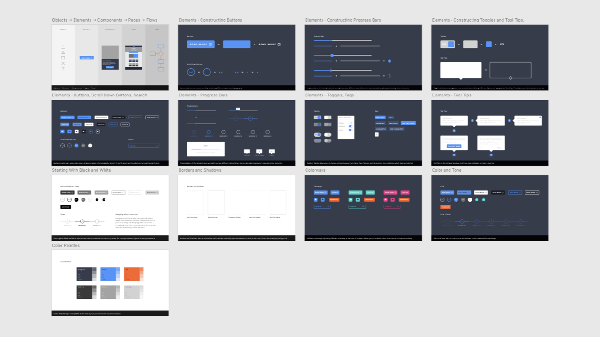

Chapter 3: Information Architecture
===================================

<!-- Before I start writing, look at Alla’s book: 1. It mentions, Alexander’s book; 2. It may mention A Pattern Language and provide visual examples. -->

<!-- 3,011 Words -->

**This is a complete rebuild…**

**I’m currently working on this chapter (4–7 August, 2019 – Ongoing; it’s been a struggle). I hope to have it in a fully readable form this week. For now, it needs a great deal of work, so it’s definitely not worth reading. I’m in it for the long haul!**

**The images, for the most part, are placeholders and draft images that I’ll develop further.**

**As I’ve noted in the [overview](https://github.com/buildingbeautifuluis/bbuis/blob/master/00-Overview.md), this is a work in progress and I’m sharing it here in draft form. The book isn’t finished, but I hope the draft content I’m providing has some value as I finalise the chapters.**

Table of Contents
-----------------

+ [Section 1: A Pattern Language](#)
+ [Section 2: Components → Patterns → Pages](#)
+ [Section 3: A Library of Patterns](#)
+ [Section 4: Information Architecture](#)
+ [Section 5: Iconic Layouts, Blockframes and Wireframes](#)
+ [Closing Thoughts and Further Reading](#)
+ [Downloadables](#)

Summary
-------

In this chapter **I’ll level up the complexity a little**. I’ll take the idea of components that I explored in Chapter 2 and develop it to explore the creation of **patterns, reusable solutions to user interface problems that occur frequently**.

Once I’ve explored patterns, **I’ll tie everything together** to consider how **we can use patterns, alongside components and objects, to build pages**. With patterns and pages covered, I’ll stress the need to consider information architecture, **so that we ensure our users can find their way to what they’re looking for**.

Lastly, I’ll introduce a number of methods – iconic layouts, blockframes and wireframes – at different levels of fidelity, which are **useful  at different stages of the design process** and which will pave the way for Chapter 4, **where I explore user flows and getting from A → B**.

Overview
--------

<!-- This might need a sentence to cover off patterns and pages. (Or it might be OK as is, because I cover this in the second half. Re-read on Thursday morning.) -->

When we design an interface, it’s important to put some thought into our overall information architecture (IA). Information architecture is focused on **organising, structuring and labelling content in a way that eases users through the overall information presented**.

Our goal as designers is to:

1. **help users find the information they’re looking for**; and

2. **enable them to complete the goals they aim to undertake**.

In order to do this, it’s important to put some thought into **how the different elements we use in an interface fit together as part of the overall system** within which they exist.

To design an effective information architecture, **we need to consider the relationship of elements at a range of different levels**:

+ The Pattern Level
+ The Page Level; and
+ The Site Level *

The components and patterns we design – the content elements that make up our pages – **will have their own information architecture that we need to consider at the micro-level**.

Similarly, pages will have a page-level information architecture, that relates to the context in which they’re consumed, for example, in a browser in a desktop or a mobile context. **How pages are laid out, with a considered hierarchy, will help users achieve their goals.**

At the macro-level, we need to **consider the overall information architecture of the site or application we’re building**. We need to **ensure that we organise our information clearly**, ensuring users understand the overall structure of the site and enabling them to build a ‘mental model’ of how everything is organised.

With the overview covered, let’s get down to business and explore some further building blocks of user interfaces: patterns.

\* Our site might, of course, be an app.

Section 1: A Pattern Language
-----------------------------

**CAPTION: Caption goes here explaining that we can refer to (and build) ‘pattern libraries’. Very short explanation of what design patterns are.**

<!--

This section will introduce the idea of patterns and pattern languages. I’ll talk about Pattern Tap, but – more importantly – I’ll talk about Christopher Alexander’s book ‘A Pattern Language’.

I’ve been in touch with Matthew Smith (who created Pattern Tap) and he’s happy with my first draft at Section 1.

-->

In Chapter 2 I introduced the idea of Design Systems. In this chapter I’d like to introduce **the idea of patterns and ‘pattern langauges’ as I begin to explore the ‘Components → _Patterns → Pages_…’ part of the interface equation**.

**_/* TIDIED TO HERE */_**

**A pattern language is a system for cataloguing and describing good design practice.** The term was coined in 1977 by the architect, Christopher Alexander (who I’ll return to shortly). Essentially pattern languages are used to gather tried and tested solutions to design problems, for example, a login pattern that’s been shown to work through testing.

The thinking behind pattern langauges pre-dates design systems by quite some time.

Pattern languages, as they relate to user interface design, were popularised by Pattern Tap, an influential website established in 2008 by the prodigiously talented Matthew Smith, **which popularised the thinking behind pattern langauges and design patterns**. Sadly, Pattern Tap is no more, lost – as so many websites are – to the ravages of lapsed domain names. You can, however, explore it via the [Wayback Machine](https://web.archive.org/web/20081102075428/http://patterntap.com/collections/).

_IMAGE /* This needs an image here_ _showing the collections overview. */_

_CAPTION: Pattern Tap saved you re-inventing the_ _user interface wheel by gathered a wealth of design patterns for inspiration._

**Pattern Tap collected examples of user interface design patterns**, largely as applied to the web. As Smith put it:

> Imagine one place where you can **drink deeply of great design patterns**. Imagine there’s no more war. There’s no more dissent. You don’t have to sludge through design after design for **the best pattern inspiration** anymore.

The site allowed you to browse curated /* Were they curated? I can’t recall. */ collections to **find design patterns that solved a particular problem you were dealing with**. It’s collections included:

- forms;
- breadcrumb trails;
- navigation;
- logins; and
- footers.

Imagine you had to include a form on a website you were creating. **Pattern Tap was useful for seeing design patterns for forms that others had designed to address this particular problem.** As Smith put it:

> Pattern Tap is here to satisfy and encourage the inspiration needs of my interface design peers. We aspire to be the one stop pattern shop for your next inspiration need.

As with my note of caution about the use of Dribbble in Chapter 2, the intention of **Pattern Tap wasn’t to provide designs to raid for aesthetics like a Viking, it was to provide different ways of tackling a design problem – using patterns – that designers could learn principles from**.

In essence, Pattern Tap was focused more on design principles – methods, approaches… – and less on surface-level, aesthetic inspiration.

### The Father of Pattern Languages

_/* This section, about Alexander’s book, might be flagged up as ‘you should read it, but you can skip it if history’s not your thing’. (See my comments below.) That said, I think it’s important. Also, there were three books, not two. (Even though Alexander's book mentions 'two halves'.) */_

Long before Pattern Tap existed there was Christopher Alexander’s 1977 book [‘A Pattern Language: Towns, Buildings, Constructions’](https://amzn.to/2JVf2UI). **Few have read the book, but Alexander’s thinking has certainly shaped where we are today.** One of two books – “two halves of a single work” – ‘A Pattern Language’ was preceded by ‘The Timeless Way of Building’.

Together, these books provided, “a language, for building and planning,” and, “the theory and instructions for the use of that language,” and were the result of eight years of practice and thought.

_This needs a little more clarity, i.e.: Alexander’s intention was to codify an approach towards building (in an architectural context) and establish a library of patterns from which an architect could draw. His book gathered examples, as in the illustration below. This still needs more to draw out the idea that underpins ‘A Pattern Language’._

_This looks interesting:_

+ _[www.resilience.org/stories/2016-10-13/working-with-patterns-an-introduction/](https://www.resilience.org/stories/2016-10-13/working-with-patterns-an-introduction/)_

_Maybe content worth adding. This abstract also summarises it well, use a blockquote:_

> _A Pattern Language by Christopher Alexander is renowned for providing simple, conveniently formatted, humanist solutions to complex design problems ranging in scale from urban planning through to interior design. This text is also believed to be the most widely read architectural treatise ever published._

> _[cityterritoryarchitecture.springeropen.com/articles/10.1186/s40410-017-0073-1](https://cityterritoryarchitecture.springeropen.com/articles/10.1186/s40410-017-0073-1)_

_The above says, “It is only one part of a trilogy of works documenting Alexander’s ‘second theory’ of architecture…” Check this. I thought it was one half (perhaps in parentheses add that, ultimately it became one of a trilogy of works). In Alexander’s book he says there are two books, a third was – perhaps – added later._

_IMAGE: Redraw from the book perhaps, as I doubt we’ll have the £s to license an image._

_CAPTION: Whilst Alexander’s work focused on architecture, the underlying methodology can be applied much more widely._

Replace ‘building’ (house) with ‘digital product’ and a great deal of Alexander’s thinking maps over.

It’s worth noting that Alexander points out – within the book’s opening paragraphs – that ‘A Pattern Language’ (specifically the one introduced in his book) is **one possible pattern langauge, i.e. it is not the only possible pattern language**.

Put simply: there are many possible patterns and the ones you choose will be influenced by your goals and your intended audience (and to a degree your individual aesthetic preferences).

_/* I hope people follow along with this as it’s important. I’m worried that some people will love this, but others will want to get down to business, but I think this needs to be included, not least as Alexander is regarded as the father of the pattern language movement. */_

_/* What this is missing, is the application of ‘A Pattern Language’ to software, etc.,. This is well-documented and I need to tease it out at the end of this part so that I bridge into the next part, moving on to explore patterns in software, and by extension, user interface design. */_

### Many patterns form a language…

**I’m working on this section just now, so it’s a bit of a work in progress. Before I start on this on Monday, read through this. There's a lot here, it just needs to be knocked into shape.**

	http://bit.ly/patternsandlanguages

_/* Perhaps this section should explore the patterns movement that Alexander helped to bring to life. This then gets unpacked in this part, which leaves the next section to really dive deep into specific examples of patterns and pages. */_

<!-- This section is where I could also use the language metaphor that I’ve noted somewhere. -->

_/* One thing I want to stress is that it's worth the time taken to build a dictionary of patterns that you can refer back to. */_

What I want to explore in this section is the idea that we can build our own encyclopaedias, or dictionaries, of examples (similar to Smith’s work with Pattern Tap). This encyclopaedia will prove incredibly valuable over time as you encounter new problems and new challenges.

It’s a good idea – especially in studio downtime – to **collect examples of the different design patterns you create on projects**. These can be useful to show clients examples of how typical design challenges are addressed. (A series of forms, for example.)

<!-- Remove the Little Thunder reference. It's too much of an in-joke. -->

There is always downtime in a studio. You can use that time to let off steam and play table tennis (as my Little Thunder studiomates do, frequently), but you can also put that time to good use, by gathering examples of patterns ‘in the wild’ that you can return to when you embark upon new projects.

By building a collection of design patterns and noting why they work, you can accelerate the design process considerably. Before you build something (which is time-consuming and expensive), you can show clients relevant examples from your library, helping them to visualise how things night look.

ADD A LINK TO A REPO HERE WITH SOME EXAMPLES. OR THIS COULD BE A NOTIST DECK. REGARDLESS, IT’S ONE OF THE BOOK’S ASSOCIATED FILES.

**Something that's worth touching upon here is the idea of an Interface Inventory (mention Brad Frost).**

Each pattern has:

- a clear name;
- an image;
- a descriptive entry; and
- cross-references.

Applying this to user interface design this might be:

- a payment form;
- a screenshot;
- an example of a payment form (for Get Invited) that’s used to gather customers’ credit card details;
- links to other payment forms you’ve designed for other projects. (So, for example, you can show clients alternative patterns.)

Just as Aexander’s thinking could be applied to the construction of buildings and, at a larger scale, towns, **it can also be applied to user interface design**. Indeed, Alexander is regarded as the father of the pattern language movement and his impact on software design is widely acknowledged.

_/* Essentially, this is where I introduce the idea – that I established in the previous chapter - that we’re building a library, a set of patterns, created from objects and components, that we’ll combine in different ways as we build our interfaces. */_

The following is from [Wikipedia](https://en.wikipedia.org/wiki/Pattern_language#What_is_a_pattern?), it captures what I want to say, but needs to be rewritten:

> _When a designer designs something – whether a house, computer program, or lamp – they must make many decisions about how to solve problems. A single problem is documented with its typical place (the syntax), and use (the grammar) with the most common and recognized good solution seen in the wild, like the examples seen in dictionaries._

> _Each such entry is a single design pattern. Each pattern has a name, a descriptive entry, and some cross-references, much like a dictionary entry. A documented pattern should explain why that solution is good in the pattern’s contexts._

Just as it’s important to consider the consistency of your components so that they meet a wide range of diverse needs, cohesively, so too it’s important to consider the consistency of your patterns.

Using the objects and components, that I explored in the previous chapter, to create patterns is where things get interesting. **We can build, from the ground up, a consistent set of elements that we can then orchestrate within pages.**

Section 2: Components → Patterns → Pages
----------------------------------------

In this section I'll focus on how we build complexity progressively as we move up a path of increasing complexity that includes:

+ Components
+ Patterns
+ Pages

**We can use our objects and components** (that we focused on in Chapter 2) **to build patterns and pages**. Take any page and you'll see it's built from these core building blocks. _/* This might be a good place for an animated GIF showing Dribbble deconstructed. */_

<!-- This will explain the context covering both patterns (showing some examples) and how we can then use these patterns, along with objects and components, to build pages (showing examples). -->

Before we explore patterns and pages in depth – and **given this chapter promises to explore information architecture** – it's important to ground everything we build, no matter how complex, with the principle of helping our users 'find their way'.

I'll dive a little deeper into this in Section 4](#), so feel free to take a round trip to that section and return here, if you wish.

As user interface designers, **our role is to orchestrate the elements on a page and impose some order on it**. Whether that page is in a desktop-, a mobile- or a wrist-based context we need to take different objects, components, patterns and groupings of content (words, imagery, video…) and organise everything.

This is where information architecture (IA) comes in.

Everything we design is created from content. When we design a UI, we take this content and we organise it, enabling the user to navigate it and helping them to quickly and easily find their way.

Our job is to consider the hierarchy of information when we design:

+ patterns;
+ pages; and
+ flows

I'll explore flows in [Chapter 4: Getting From A → B](#) so – in this chapter, I'll focus on patterns and pages – but the overall emphasis remains the same. We need to ensure everything is clearly signposted.

**CAPTION: In the above screenshot – of Dribbble – we see that there's an information architecture at *both* the pattern and page level.**

Analysing how different interfaces work at different levels of information hierarchy (Components → Patterns → Pages) will give you a clearer understanding of how to manage the information architecture when you build your own user interfaces.

There's an information architecture at each of these resolutions: patterns will have their own information architecture, as will pages, which are, more often than not, created from components.

### Information Architecture at the Pattern Level (Micro)

Let's take a look at Dribbble's 

For example, a simple profile card might have three groupings of information:

+ User Profile
+ Social
+ Tags

<!--

NNg:

Just like the  [IA](https://www.nngroup.com/articles/ia-vs-navigation/)  reflects the information structure of a website, the  [mini-IA](https://www.nngroup.com/articles/mini-ia-structuring-information/) , which is made up of all the page headings and subheadings, reflects the information structure of a page.

-->

In terms of sub-sections, these might be…

### Anatomy of a Pattern (Micro IA)

This takes something like a Dribbble shot pattern (a card) and shows how it's structured. Draw attention to the buttons so that I can show how objects and components come together in patterns.

### Anatomy of a Page (Macro IA)

This takes a page and shows how it's structured and organised. Dribbble page, perhaps. So we see how the card pattern for the shots comes together in the context of the page.

Section 3: A Library of Patterns
--------------------------------

This section will echo the section from Chapter 2 called a ‘A Library of Components’. I’ll use the section to introduce (five?) patterns (and mention others). Essentially this will be like:

	https://design-system.service.gov.uk/patterns/

I’ll talk about patterns like: cards for a user profile; a date picker; a credit card form; etc.. It will largely be show and tell and will be accompanied by XD files like Chapter 2.

I’ll explore five patterns (echoing Chapter 2, where I also explored five components), I’ll also list others that you might need to consider.

	https://uxuigifs.tumblr.com/

**SO THIS WOULD BE 1/5 EXAMPLES**

### Sign-In Forms

I’ve focused on sign in forms because they explore forms (about which entire books have been written, like XXXX’s excellent [XXXX]), but they do so in a focused way. If your project includes forms – and it is very likely to – I’d highly recommend XXXX’s [XXXX], it’s thorough and comprehensive and – like all books published by Smashing Magazine – it’s beautifully designed and printed.

Sign in forms generally require two pieces of data:

+ a username; and
+ a password.

They should also include an option to navigate to a sign up page, in case a user doesn’t have an account. Equally, they should include an opportunity to reset your password (or get help), should you have forgotten your login details.

Section 4: Information Architecture
-----------------------------------

This chapter is title ‘Information Architecture’, so I think it’s important I explain what that means. Donna Spence’s Five Simple Steps book explains this well (p3-4 are great), essentially explaining that Information Architecture is all about:

1. Organising content or objects;
2. Describing them clearly;
3. Providing ways for people to get to them.

The above is true of: **parts of a page** (patterns, e.g. forms); **the page itself**; and **the page in relation to other pages**.

At this point I’ll use the supermarket metaphor that Donna Spencer has used in her book. Donna used chocolate, but I’m using ice cream. (The freezers are broken, so it’s as if this page is down for maintenance.) I can find what I’m looking for, however…

ICE CREAM STORY HERE

### Wayfinding

There is probably a subsection on wayfinding, this might include:

+ Breadcrumb Trails
+ Shopping Cart Process
+ Revisit the component from C2.

Section 5: Iconic Layouts, Blockframes and Wireframes
-----------------------------------------------------

**CAPTION: Caption here.**

I could use ‘Iconic Layouts, Blockframes and Wireframes’ as the last section. This would allow me to talk about mapping out pages at an iconic, high level before I move on to cover flows in Chapter 4.

These are microlayouts, they’re at a level of fidelity that you can get a feel for the overall look and feel of a page, but they’re not so detailed that they absorb too much time before you explore user flows. At the end of the introductory text, stress that I’ll explore the layout of pages in more detail in [Chapter 6: Designing Desktop Interfaces], where I’ll cover:

+ The Importance of a Clear Visual Hierarchy
+ Typography at the Page Level
+ Composition and Grid Systems

If you want to get a more in-depth view, you might want to take a round trip to [Chapter 6: Designing Desktop Interfaces](#) and return here, before we move on to [Chapter 4: Getting From A → B](#), where I’ll explore user flows and overall site and application structure.

### Iconic Layouts

This kicks off with revisiting April Grieman’s iconic layouts for Vitra magazine. They struck me as interesting at the time (19XX). They very much pre-dated the web, but they looked similar to the kinds of low level iconic layouts I would use in a project to map out flows…

1. Show an example, by Grieman.
2. Show my Camper / Glyph sketches.

The idea for 'Iconic Layouts' is drawn from April Grieman's 1990 book 'Hybrid Imagery: The Fusion of Technology and Graphic Design'. The world has moved on a great deal since 1990, but one idea that Grieman explored has stuck with me over three decades later…

Grieman referred to her initial digital sketches – for Workspirit Magazine (a publication for Swiss furniture manufacturer Vitra) – as the 'iconic' first stage. As she put it:

> A surprise in producing [the] initial miniature version was that I could see the whole magazine as a kind of 'iconic texture', free from detail.

**CAPTION: Grieman's overall page printouts reminded me of the iconic layouts I often sketch at the initial paper prototyping phase of a project.**

I've used this approach ever since. By creating 'iconic' layouts – very small layouts, focused on scale, color and tone, the hierarchy of pages can be grasped at a high level (a birds' eye view).

This approach allows you to establish page layouts and get a feel for their flows.

/* Insert blockframes here? YES? NO? READ TOMORROW. */

If I put blockframes in here, I need to emphasise their role. They're not about designing in the absence of content (which is never a good idea), they're about getting a feel for the overall page and its content hierarchy.

Expand on this by referencing the Medium article:

https://medium.com/ux-power-tools/blockframing-and-31-free-sketch-ready-layouts-using-auto-layout-by-anima-app-1be039007ecf

By Jon Moore. (Also give Jon Moore credit for his UX Power Tools downloadables.)

Closing Thoughts
----------------

Some closing thoughts here paving the way for the next chapter.

### So, what did we learn?

After reading Chapter 3, you should understand that:

1. **Objects and Components can be combined to create Patterns and all of these elements can be orchestrated to create pages.**

2. Something else…

3. Something else…

Lastly, I’ve introduced you to **some typical patterns you’ll encounter when you begin to design user interaces**: A, B, C, D and E. _/* These will be swapped out after I've written the chapter, */_

Further Reading
---------------

There are many great publications, offline and online, that will help further underpin your understanding of information architecture. I’ve included a few below to start you on your journey.

+ Donna Spencer’s [A Practical Guide to Information Architecture](https://amzn.to/2IkHeRl) – whilst sadly no longer available in print – is, as its title suggests, a practical guide to information architecture. Originally published by Five Simple Steps, I’d strongly recommend buying the Kindle book, which provides a thorough overview of the principles of managing and orchestrating content.

+ usability.gov has an excellent overview of [Information Architecture Basics](https://www.usability.gov/what-and-why/information-architecture.html) that’s well worth reading. The site is an excellent resource that – whilst primarily focused on design for government – offers a wide range of resources that are applicable beyond design for the public sector.

+ Finally, Steve Krug’s [Don’t Make Me Think, Revisited: A Common Sense Approach to Web Usability](https://amzn.to/2Xa5DS3) is a timeless book that I’d highly recommend. Whilst focused on usability, it contains a wealth of insights that are applicable when considering your overall information architecture.

<!--

Downloadables
-------------

_/* This doesn't need to be repeated every time. Think about how these downloadables are introduced for other chapters. */_

I’ve created a series of supporting files – reference files and Adobe XD artboards – to accompany the chapter content above. **These supporting files walk through the process for more visual learners and can be used alongside the book.**

I’ve designed all of the XD artboards myself (except the swipe files, where I reference others’ work with accompanying analysis). **You’re free to use the content of the XD artboards to assist your learning, however, I retain the copyright.**

+ [XD Artboards](#) [Coming soon.]
+ [PDF Swipe File (With Example Elements)](#) [Coming soon.]
+ [Master-Apprentice Exercises](#) [Coming soon.]

You can download, adapt or transform the files (non-commercially, for educational purposes), but you cannot use them for commercial purposes.

+ [Copyright · Mr Murphy ®](https://mrmurphy.com/)

**I hope you can see from the supporting files that I put a lot of work into creating them. I’d appreciate your respecting their copyright.**

**#karma**

-->

About the Author
----------------

### Christopher Murphy

[@fehler](https://www.twitter.com/fehler)

A designer, writer and speaker based in Belfast, Christopher mentors purpose-driven businesses, helping them to launch and thrive. He encourages small businesses to think big and he enables big businesses to think small.

As a design strategist he has worked with companies, large and small, to help drive innovation, drawing on his 25+ years of experience working with clients including: Adobe, EA and the BBC.

The author of numerous books, he is currently hard at work on his eighth, ‘Designing Delightful Experiences’, for Smashing Magazine and ninth, ‘Building Beautiful UIs’, for Adobe. Both are accompanied by a wealth of digital resources, and are drawn from Christopher’s 15+ years of experience as a design educator.

---

I hope you find this resource useful. I’m also currently working on a book for the fine folks at [Smashing Magazine](https://www.smashingmagazine.com) – ‘Designing Delightful Experiences’ – which focuses on the user experience design process from start to finish. It will be published in late 2019.

You might like to [follow me on Twitter](https://www.twitter.com/fehler) for updates on this book and other projects I’m working on.

Copyright · Mr Murphy + Adobe  
Design and Build · Dan Gold + Little Thunder