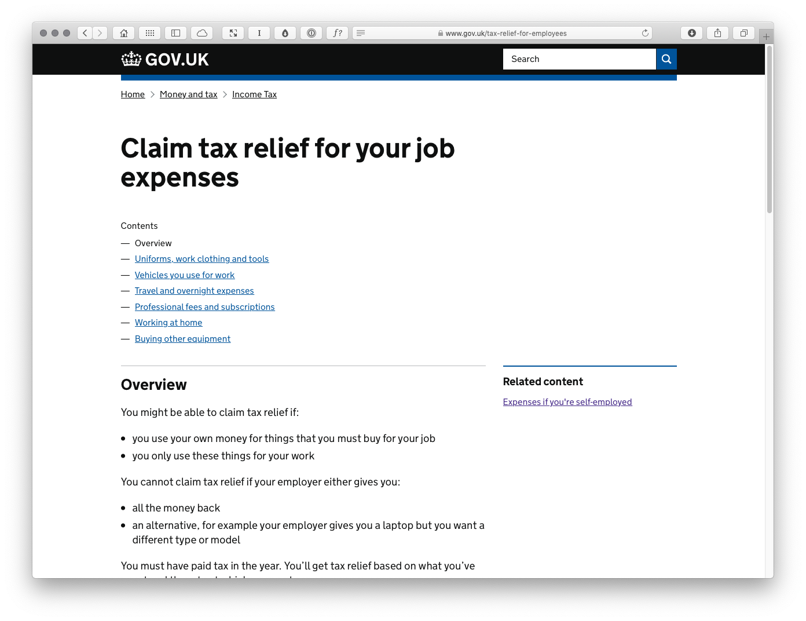
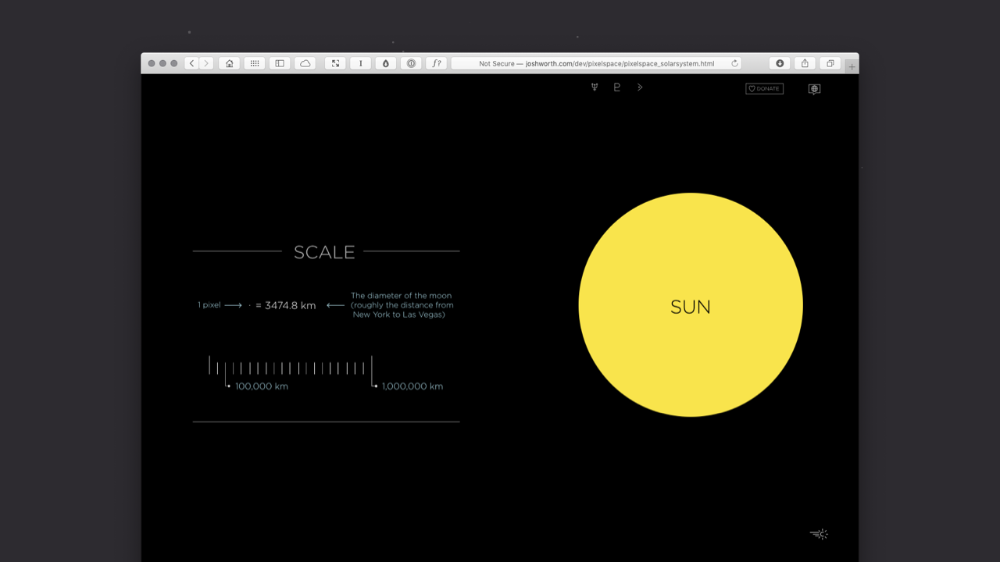
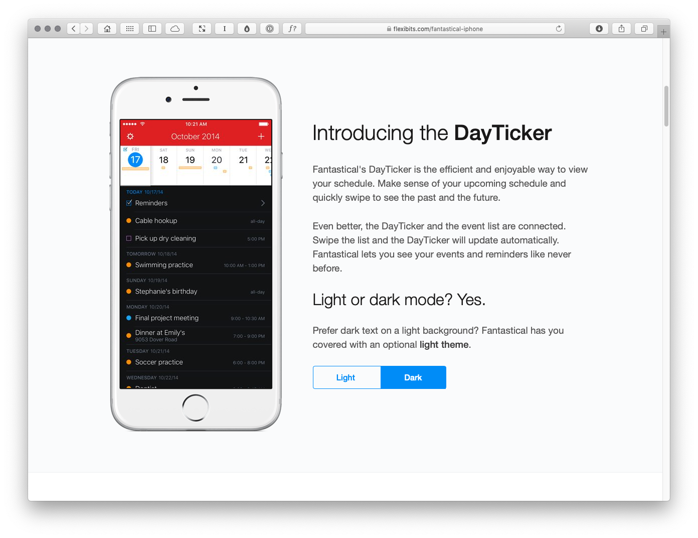
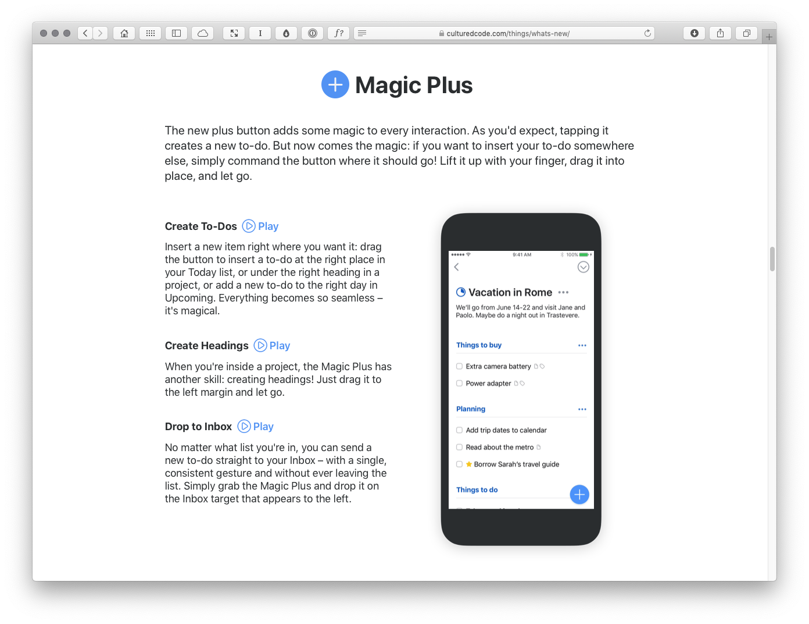
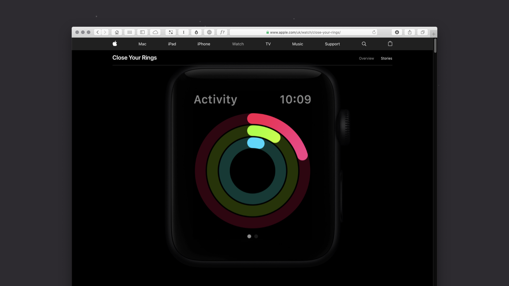
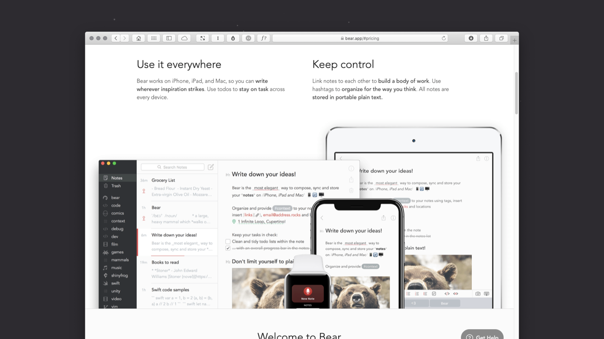

Master-Apprentice Exercises
===========================

<!-- 989 Words -->

**As I’ve noted in the [overview](https://github.com/fehler/building-beautiful-uis/blob/master/00-Overview.md), this is a work in progress and I’m sharing it here in draft form. It isn’t finished, but I hope it provides some value as I finalise all of the chapter content.**

You can learn a great deal by looking at others’ work and analysing it. Breaking down existing user interfaces and rebuilding them in XD will teach you how to ‘see through the eyes of others’.

I’ve included some ‘Master-Apprentice’ exercises where I’ve analysed a variety of interfaces in different contexts:

+ Desktop
+ Mobile (Smartphone, Tablet)
+ Wrist

I use this Master-Apprentice approach in my teaching at Belfast School of Art, and the students who undertake the exercises invariably end up learning much faster and producing more refined work as a consequence. I hope you find the examples useful.

Looking at these interfaces and how they are structured will teach you about user interface design and information architecture in different contexts: from the relative space of a desktop context to the tighter confines of a wrist context.

I’ve undertaken a few exercises that I’ve included to demonstrate how I learn about user interface design by analysing, deconstructing and reconstructing others’ work.

Desktop
-------

The desktop examples I’ve included are browser-focused, but the principles apply equally to desktop software.

### GOV.UK

The UK government’s award-winning [GOV.UK](https://www.gov.uk) website is an excellent example of a website that simplifies complex information. It’s user interface is clear and information-focused, which serves its users well. The information hierarchy – at both the site-level and the page-level – is clear, enabling users to navigate the information presented easily.

+ [Claim tax relief for your job expenses](https://www.gov.uk/tax-relief-for-employees)

---

### If the Moon Were Only 1 Pixel

A side project by Josh Worth, [If the Moon Were Only 1 Pixel](https://www.joshworth.com/portfolio-items/if-the-moon-were-only-1-pixel/) does a wonderful job of visualising complex information. I’ve intentionally included this more experiemtal example to show what’s possible with very minimal building blocks of interfaces: points, lines and planes of color.

+ [If the moon were only 1 pixel…](http://joshworth.com/dev/pixelspace/pixelspace_solarsystem.html)

---

Mobile (Smartphone, Tablet)
---------------------------

The mobile examples I’ve included are for iOS (because I have an iPhone), but – broadly – the principles of information architecture and user interface design map over to other mobile platforms.

### Fantastical

Fantastical 2 for iOS by [Flexibits](https://flexibits.com) is a lovely example of an mobile application that condenses a great deal of information into a beautifully designed user interface. As a calendar and reminders app it has to fit a great deal into a small space and it does so minimally and elegantly.

+ [Fantastical](https://flexibits.com/fantastical-iphone)

---

### Things 3

Things 3 for iOS by [Cultured Code](https://culturedcode.com/things/) is an award-winning personal task manager. The app’s user interface not only looks stunning, it **feels** stunning with delightful interactions that communicate how the app works to the user. In this file, I’ve also shown how Things 3 condenses down into a watchOS app so you can see the challenges of designing the same app in two very different contexts.

+ [Things 3](https://culturedcode.com/things/whats-new/)

---

Wrist
-----

The wrist examples I’ve included are for Apple’s watchOS (because I have an Apple Watch). If possible – and of course affording every single device is an issue! – it helps to own the devices you’re designing for so you can truly understand them by using them regularly. 

### Activity

At its heart the Activity app for the [Apple Watch](https://www.apple.com/uk/watch/) is just a series of concentric circles (with a more detailed information view available via a scroll). The circle’s bold colours and the animations as they build in add to the delight of the minimal user interface, providing an update on your progress as you aim to close your rings.

+ [Activity](https://www.apple.com/uk/watch/close-your-rings/)

---

### Bear

Despite occupying a very small amount of space, the watchOS version of [Bear](https://bear.app/faq/Bear%20for%20Apple%20Watch%20overview/) – a note-taking app – provides a wealth of information. The user interface enables you to dictate short notes and browse previous notes on the go all within the confines of a very small screen. Its user interface is focused, minimal and elegant.

+ [Bear](https://bear.app)

About the Author
----------------

### Christopher Murphy

[@fehler](https://www.twitter.com/fehler)

A designer, writer and speaker based in Belfast, Christopher mentors purpose-driven businesses, helping them to launch and thrive. He encourages small businesses to think big and he enables big businesses to think small.

The author of numerous books, he is currently hard at work on his eighth, ‘Designing Delightful Experiences’, for Smashing Magazine and ninth, ‘Building Beautiful UIs’, for Adobe. Both are accompanied by a wealth of digital resources, and are drawn from Christopher’s 15+ years of experience as a design educator.

As a design strategist he has worked with companies, large and small, to help drive innovation, drawing on his 25+ years of experience working with clients including: Adobe, EA and the BBC.

---

I hope you find this resource useful. I’m also currently working on a book for the fine folks at [Smashing Magazine](https://www.smashingmagazine.com) – ‘Designing Delightful Experiences’ – which focuses on the user experience design process from start to finish. It will be published in late 2019.

You might like to [follow me](https://www.twitter.com/fehler) on Twitter for updates on this book, that book and other projects I’m working on.

**Copyright · Adobe XD + Mr Murphy Ltd.**