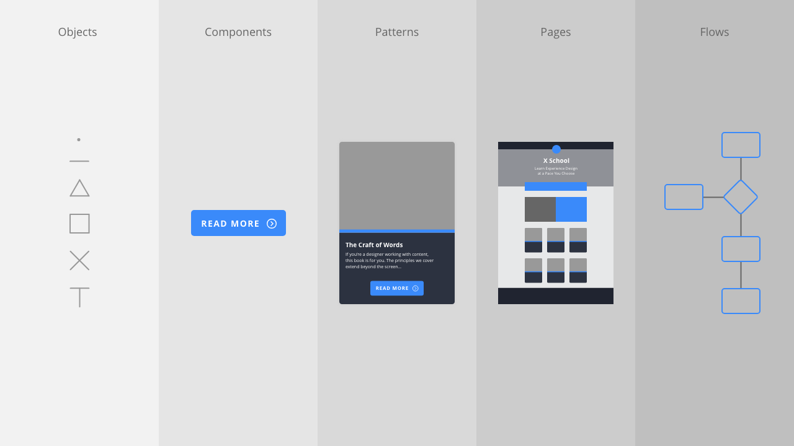

Section 2: Objects → Components → Patterns → Pages → Flows
----------------------------------------------------------

**CAPTION: Everything we build is created from relatively simple objects. By combining these objects in different ways we can create different user interface components, which can then be combined to create patterns that are then organised on pages. Link these pages together and we have the flows that underpin our user interface.**

**Everything we create is built from smaller parts.** At the simplest level, user interfaces are comprised of the following:

+ **Objects:** An object is a basic building block from which we build interfaces: points (circles), lines and planes; icons; and typographic elements. (Icons are built from objects, too.)

+ **Components:** A component is *created from objects* and is something like [a button](images/ch2/buttons.png), [a toggle](images/ch2/toggles.png), or [a progress indicator](images/ch2/progress-indicators.png).

+ **Patterns:** A pattern is *created from components* and is something like a [card](https://design-system.futurelearn.com/molecules/card), a [date picker](https://design-system.futurelearn.com/molecules/date-input), or a [feed item](https://design-system.futurelearn.com/molecules/feed-item).

+ **Pages:** A page is *created from objects, components and patterns*.

+ **Flows:** A flow is *created from a series of pages that are linked together*. A flow is what we’re building towards – **from the ground up** – and is the most complex part of the equation.

In this chapter, **I’ll be focusing on components, demonstrating how they can be built from simple objects: points (circles), lines and planes; icons; and typographic elements**.

In the next chapter, I’ll show how these **components can be combined to create patterns and pages**, which form the backbone of our user interfaces. In the following chapter, I’ll explore how **we can tie these separate pages together into flows that allow a user to navigate through an interface**.

This approach – Objects → Components → Patterns → Pages → Flows – is similar to Brad Frost’s [Atomic Design](http://atomicdesign.bradfrost.com/chapter-2/) methodology. I never dived deep into science, so **I find Frost’s naming convention – which features a metaphor of ‘atoms’ and ‘molecules’ from the world of chemistry, and ‘organisms’ from the world of biology – a little confusing**.

Frost’s methodology is also **directed primarily at front-end designers who are using HTML, CSS and JavaScript**. Designing interfaces in a tool like Adobe XD is increasingly separated from the world of code. (Although, to be clear – in case I spark the ‘designers should know how to code’ debate – **it’s critical at the very least to have an understanding of code!**)

That Frost’s Atomic Design methodology has shaped our thinking, is beyond doubt. **His approach encouraged us to think about what we build in a much more systematic way:** laying the foundations by focusing on re-usable, ‘atomic’ elements that are then orchestrated into progressively more complex elements that are then – collectively – used as the basis for pages.

That said, **I’ve adopted a less complicated naming system, which I believe is easier to understand**, after having tried and tested it on my students and studiomates.

Given the rise of different specialisms that we’re seeing emerging in the world of user experience design, I believe **there’s a need for a different naming convention, one that’s specifically focused on visual designers creating user interfaces**.

Looking at the illustration at the beginning of this section, I prefer the labels: **objects, components, patterns, pages and flows**. I find these labels easier to grasp and they should, I feel, need no explanation.

I’ve drawn these terms by looking at the work of others, particularly the award-winning GOV.UK team’s work on the [GOV.UK Design System](https://design-system.service.gov.uk). As GOV.UK put it:

> Learn from the research and experience of other service teams and avoid repeating work that’s already been done.

There’s no need to reinvent the wheel and, in the spirit of reusing existing naming conventions, I’ve drawn my naming methodology from their work, adding the term ‘objects’ to explain the fundamental building blocks from which all of our user interfaces are created.